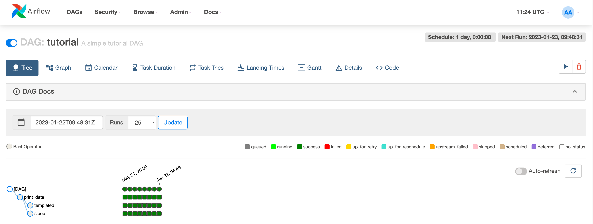

# Tutorial Airflow

## Creating a Docker compose

- From official installation
  https://airflow.apache.org/docs/apache-airflow/stable/howto/docker-compose/index.html

- The most important steps are to download the docker compose file and the
  interface script
  ```
  > curl -LfO 'https://airflow.apache.org/docs/apache-airflow/2.8.2/docker-compose.yaml'

  > curl -LfO 'https://airflow.apache.org/docs/apache-airflow/2.8.3/airflow.sh'
  > chmod +x airflow.sh
  ```

- Linux and Mac Docker have slightly behaviors in terms of handling permissions.
  If you see that files created inside the container are owned by root you might
  need to run:
  ```bash
  > echo -e "AIRFLOW_UID=$(id -u)" > .env
  ```

## Overview of the docker-compose

- Go to the tutorial dir
  ```bash
  > cd $GIT_ROOT/tutorials/tutorial_airflow

  > ls -1
  README.md
  airflow.png
  airflow.sh
  dags
  docker-compose.yaml
  docker_clean.sh
  docker_ls.sh
  ```

- Let's take a look
  ```bash
  > vi docker-compose.yaml airflow.sh
  ```

## Clean up the environment

- Check which images are available
  ```bash
  > docker_ls.sh
  # Airflow
  apache/airflow                                            2.8.2             5269ac598592   13 days ago     1.42GB
  # Postgres
  postgres                                                  13                b1962b852ef6   2 weeks ago     440MB
  postgres                                                  14.0              01b2dbb34042   2 years ago     354MB
  # Redis
  redis                                                     alpine            fec7877f3c24   2 months ago    41.6MB
  redis                                                     latest            f361c7d940d4   2 months ago    158MB
  ```

- In practice it does:
  ```bash
  > more docker_ls.sh
  #!/bin/bash
  echo "# Airflow"
  docker images | grep airflow
  echo "# Postgres"
  docker images | grep postgres
  echo "# Redis"
  docker images | grep redis
  ```

- To stop Airflow and delete the state
  ```bash
  > docker compose ls
  NAME                STATUS              CONFIG FILES

  > docker compose down --volumes --remove-orphans
  [+] Running 10/10
   ✔ Container tutorial_airflow-airflow-worker-1              Removed
   ✔ Container tutorial_airflow-airflow-webserver-1           Removed
   ✔ Container tutorial_airflow-airflow-scheduler-1           Removed
   ✔ Container tutorial_airflow-airflow-triggerer-1           Removed
   ✔ Container tutorial_airflow-airflow-init-1                Removed
   ✔ Container tutorial_airflow-postgres-1                    Removed
   ✔ Container tutorial_airflow-redis-1                       Removed
   ✔ Container tutorial_airflow-airflow-cli-run-deb05bb521af  Removed
   ✔ Volume tutorial_airflow_postgres-db-volume               Removed
   ✔ Network tutorial_airflow_default                         Removed
  ```

## Starting Airflow

- Initialize Airflow DB
  ```bash
  > docker compose up airflow-init
  WARN[0000] The "AIRFLOW_UID" variable is not set. Defaulting to a blank string.
  WARN[0000] The "AIRFLOW_UID" variable is not set. Defaulting to a blank string.
  [+] Running 5/4
   ✔ Network tutorial_airflow_default              Created
   ✔ Volume "tutorial_airflow_postgres-db-volume"  Created
   ✔ Container tutorial_airflow-redis-1            Created
   ✔ Container tutorial_airflow-postgres-1         Created
   ✔ Container tutorial_airflow-airflow-init-1     Created
  Attaching to tutorial_airflow-airflow-init-1
  ...
  tutorial_airflow-airflow-init-1  | User "airflow" created with role "Admin"
  tutorial_airflow-airflow-init-1  | 2.8.2
  tutorial_airflow-airflow-init-1 exited with code 0
  ```

- To start Airflow:
  ```bash
  > docker compose up
  ...
  tutorial_airflow-airflow-webserver-1  | [2024-03-10 14:00:54 +0000] [15] [INFO] Listening at: http://0.0.0.0:8080 (15)
  tutorial_airflow-airflow-webserver-1  | [2024-03-10 14:00:54 +0000] [15] [INFO] Using worker: sync
  tutorial_airflow-airflow-webserver-1  | [2024-03-10 14:00:54 +0000] [27] [INFO] Booting worker with pid: 27
  tutorial_airflow-airflow-webserver-1  | [2024-03-10 14:00:54 +0000] [28] [INFO] Booting worker with pid: 28
  tutorial_airflow-airflow-webserver-1  | [2024-03-10 14:00:54 +0000] [29] [INFO] Booting worker with pid: 29
  tutorial_airflow-airflow-webserver-1  | [2024-03-10 14:00:54 +0000] [30] [INFO] Booting worker with pid: 30
  ```
- It takes a bit of time to start all the containers, there might be warnings,
  but as long as it gets to `Listening at...` it's all good

- To start a `bash` inside the Airflow container:
  ```bash
  > ./airflow.sh bash
  ```
  - This is equivalent to `docker_bash.sh` in other tutorials

- The webserver is available at http://localhost:8080
  - The default account has the login `airflow` and the password `airflow`.

## Interacting with Airflow

- The code of the tutorial is at:
  ```bash
  > vi $GIT_ROOT/tutorials/tutorial_airflow/dags/airflow_tutorial.py
  ```

- Refs
  - https://airflow.apache.org/docs/apache-airflow/stable/tutorial/fundamentals.html
  - https://airflow.apache.org/docs/apache-airflow/2.2.2/tutorial.html

- Lots of the Airflow commands can be executed through the CLI or the web
  interface

- Make sure that the DAG pipeline is parsed successfully
  ```
  > airflow.sh bash
  docker> python dags/airflow_tutorial.py
  ```

- Interacting with the CLI
  ```
  docker> airflow -h
  Usage: airflow [-h] GROUP_OR_COMMAND ...

  Positional Arguments:
    GROUP_OR_COMMAND

      Groups
        celery         Celery components
        config         View configuration
        connections    Manage connections
        dags           Manage DAGs
        db             Database operations
        jobs           Manage jobs
        pools          Manage pools
        providers      Display providers
        roles          Manage roles
        tasks          Manage tasks
        users          Manage users
        variables      Manage variables

      Commands:
        cheat-sheet    Display cheat sheet
        dag-processor  Start a standalone Dag Processor instance
        info           Show information about current Airflow and environment
        kerberos       Start a kerberos ticket renewer
        plugins        Dump information about loaded plugins
        rotate-fernet-key
                       Rotate encrypted connection credentials and variables
        scheduler      Start a scheduler instance
        standalone     Run an all-in-one copy of Airflow
        sync-perm      Update permissions for existing roles and optionally DAGs
        triggerer      Start a triggerer instance
        version        Show the version
        webserver      Start a Airflow webserver instance

  Optional Arguments:
    -h, --help         show this help message and exit
  ```

- Print the list of active DAGs
  ```bash
  docker> airflow dags list
  dag_id   | filepath            | owner   | paused
  =========+=====================+=========+=======
  tutorial | airflow_tutorial.py | airflow | True
  ```

- If you go to the GUI and enable the DAG, it is reflected in the CLI
  ```bash
  docker> airflow dags list
  dag_id   | filepath            | owner   | paused
  =========+=====================+=========+=======
  tutorial | airflow_tutorial.py | airflow | False
  ```

- Print the list of tasks in the "tutorial" DAG
  ```
  docker> airflow tasks list tutorial
  print_date
  sleep
  templated
  ```

- Print the hierarchy of tasks in the "tutorial" DAG.
  ```
  docker> airflow tasks list tutorial --tree
  <Task(BashOperator): print_date>
    <Task(BashOperator): sleep>
    <Task(BashOperator): templated>
  ```

- Testing `print_date` task by executing with a logical / execution date in the past:
  ```
  docker> airflow tasks test tutorial print_date 2015-06-01
  [2024-03-12T09:40:05.069+0000] {dagbag.py:540} INFO - Filling up the DagBag from /opt/***/dags
  [2024-03-12T09:40:05.173+0000] {taskinstance.py:1979} INFO - Dependencies all met for dep_context=non-requeueable deps ti=<TaskInstance: tutorial.print_date __***_temporary_run_2024-03-12T09:40:05.142028+00:00__ [None]>
  [2024-03-12T09:40:05.176+0000] {taskinstance.py:1979} INFO - Dependencies all met for dep_context=requeueable deps ti=<TaskInstance: tutorial.print_date __***_temporary_run_2024-03-12T09:40:05.142028+00:00__ [None]>
  [2024-03-12T09:40:05.176+0000] {taskinstance.py:2193} INFO - Starting attempt 1 of 2
  [2024-03-12T09:40:05.177+0000] {taskinstance.py:2272} WARNING - cannot record queued_duration for task print_date because previous state change time has not been saved
  [2024-03-12T09:40:05.177+0000] {taskinstance.py:2214} INFO - Executing <Task(BashOperator): print_date> on 2015-06-01 00:00:00+00:00
  [2024-03-12T09:40:05.387+0000] {taskinstance.py:2510} INFO - Exporting env vars: AIRFLOW_CTX_DAG_EMAIL='***@example.com' AIRFLOW_CTX_DAG_OWNER='***' AIRFLOW_CTX_DAG_ID='tutorial' AIRFLOW_CTX_TASK_ID='print_date' AIRFLOW_CTX_EXECUTION_DATE='2015-06-01T00:00:00+00:00' AIRFLOW_CTX_TRY_NUMBER='1' AIRFLOW_CTX_DAG_RUN_ID='__***_temporary_run_2024-03-12T09:40:05.142028+00:00__'
  [2024-03-12T09:40:05.389+0000] {subprocess.py:63} INFO - Tmp dir root location: /tmp
  [2024-03-12T09:40:05.389+0000] {subprocess.py:75} INFO - Running command: ['/usr/bin/bash', '-c', 'date']
  [2024-03-12T09:40:05.396+0000] {subprocess.py:86} INFO - Output:
  [2024-03-12T09:40:05.400+0000] {subprocess.py:93} INFO - Tue Mar 12 09:40:05 UTC 2024
  [2024-03-12T09:40:05.400+0000] {subprocess.py:97} INFO - Command exited with return code 0
  [2024-03-12T09:40:05.405+0000] {taskinstance.py:1149} INFO - Marking task as SUCCESS. dag_id=tutorial, task_id=print_date, execution_date=20150601T000000, start_date=, end_date=20240312T094005
  ```
  - The execution date is 2015-06-01 but the date printed is today because `date`
    is not "mocked"

- Testing `sleep` task
  ```
  docker> airflow tasks test tutorial sleep 2015-06-01
  [2024-03-12T09:41:51.859+0000] {dagbag.py:540} INFO - Filling up the DagBag from /opt/***/dags
  [2024-03-12T09:41:51.950+0000] {taskinstance.py:1979} INFO - Dependencies all met for dep_context=non-requeueable deps ti=<TaskInstance: tutorial.sleep __***_temporary_run_2024-03-12T09:41:51.931244+00:00__ [None]>
  [2024-03-12T09:41:51.953+0000] {taskinstance.py:1979} INFO - Dependencies all met for dep_context=requeueable deps ti=<TaskInstance: tutorial.sleep __***_temporary_run_2024-03-12T09:41:51.931244+00:00__ [None]>
  [2024-03-12T09:41:51.953+0000] {taskinstance.py:2193} INFO - Starting attempt 1 of 4
  [2024-03-12T09:41:51.953+0000] {taskinstance.py:2272} WARNING - cannot record queued_duration for task sleep because previous state change time has not been saved
  [2024-03-12T09:41:51.954+0000] {taskinstance.py:2214} INFO - Executing <Task(BashOperator): sleep> on 2015-06-01 00:00:00+00:00
  [2024-03-12T09:41:52.038+0000] {taskinstance.py:2510} INFO - Exporting env vars: AIRFLOW_CTX_DAG_EMAIL='***@example.com' AIRFLOW_CTX_DAG_OWNER='***' AIRFLOW_CTX_DAG_ID='tutorial' AIRFLOW_CTX_TASK_ID='sleep' AIRFLOW_CTX_EXECUTION_DATE='2015-06-01T00:00:00+00:00' AIRFLOW_CTX_TRY_NUMBER='1' AIRFLOW_CTX_DAG_RUN_ID='__***_temporary_run_2024-03-12T09:41:51.931244+00:00__'
  [2024-03-12T09:41:52.039+0000] {subprocess.py:63} INFO - Tmp dir root location: /tmp
  [2024-03-12T09:41:52.040+0000] {subprocess.py:75} INFO - Running command: ['/usr/bin/bash', '-c', 'sleep 5']
  [2024-03-12T09:41:52.047+0000] {subprocess.py:86} INFO - Output:
  [2024-03-12T09:41:57.052+0000] {subprocess.py:97} INFO - Command exited with return code 0
  [2024-03-12T09:41:57.063+0000] {taskinstance.py:1149} INFO - Marking task as SUCCESS. dag_id=tutorial, task_id=sleep, execution_date=20150601T000000, start_date=, end_date=20240312T094157
  ```
  - You can see the sleep of 5 secs
    ```bash
    ...
    [2024-03-12T09:41:52.047+0000] {subprocess.py:86} INFO - Output:
    [2024-03-12T09:41:57.052+0000] {subprocess.py:97} INFO - Command exited with return code 0
    ...
    ```

- Let's run a backfill for a week:
  ```bash
  docker> airflow dags backfill tutorial --start-date 2015-06-01 --end-date 2015-06-07
  [2024-03-12T09:42:41.094+0000] {dagbag.py:540} INFO - Filling up the DagBag from /opt/airflow/dags
  [2024-03-12T09:42:41.113+0000] {executor_loader.py:115} INFO - Loaded executor: CeleryExecutor
  [2024-03-12T09:42:41.418+0000] {base_executor.py:146} INFO - Adding to queue: ['airflow', 'tasks', 'run', 'tutorial', 'print_date', 'backfill__2015-06-01T00:00:00+00:00', '--depends-on-past', 'ignore', '--local', '--pool', 'default_pool', '--subdir', 'DAGS_FOLDER/airflow_tutorial.py']
  [2024-03-12T09:42:41.422+0000] {base_executor.py:146} INFO - Adding to queue: ['airflow', 'tasks', 'run', 'tutorial', 'print_date', 'backfill__2015-06-02T00:00:00+00:00', '--local', '--pool', 'default_pool', '--subdir', 'DAGS_FOLDER/airflow_tutorial.py']
  [2024-03-12T09:42:41.426+0000] {base_executor.py:146} INFO - Adding to queue: ['airflow', 'tasks', 'run', 'tutorial', 'print_date', 'backfill__2015-06-03T00:00:00+00:00', '--local', '--pool', 'default_pool', '--subdir', 'DAGS_FOLDER/airflow_tutorial.py']
  [2024-03-12T09:42:41.430+0000] {base_executor.py:146} INFO - Adding to queue: ['airflow', 'tasks', 'run', 'tutorial', 'print_date', 'backfill__2015-06-04T00:00:00+00:00', '--local', '--pool', 'default_pool', '--subdir', 'DAGS_FOLDER/airflow_tutorial.py']
  [2024-03-12T09:42:41.434+0000] {base_executor.py:146} INFO - Adding to queue: ['airflow', 'tasks', 'run', 'tutorial', 'print_date', 'backfill__2015-06-05T00:00:00+00:00', '--local', '--pool', 'default_pool', '--subdir', 'DAGS_FOLDER/airflow_tutorial.py']
  [2024-03-12T09:42:41.437+0000] {base_executor.py:146} INFO - Adding to queue: ['airflow', 'tasks', 'run', 'tutorial', 'print_date', 'backfill__2015-06-06T00:00:00+00:00', '--local', '--pool', 'default_pool', '--subdir', 'DAGS_FOLDER/airflow_tutorial.py']
  [2024-03-12T09:42:41.441+0000] {base_executor.py:146} INFO - Adding to queue: ['airflow', 'tasks', 'run', 'tutorial', 'print_date', 'backfill__2015-06-07T00:00:00+00:00', '--local', '--pool', 'default_pool', '--subdir', 'DAGS_FOLDER/airflow_tutorial.py']
  ```
  - This is going to take some time since it needs to execute a lot of `sleep 5`
  - Backfilling will respect dependencies, emit logs, update DB to record status

- On the web-server you can see that all the DAG executions completed
  successfully 

- Then you can go to the GUI and take a look
  ```
  http://localhost:8080/dags/tutorial/grid?root=
  ```
