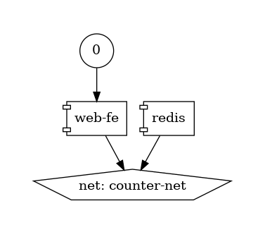

# Docker Compose Tutorial

## Files

- This example is a simple Flask app that counts the number of times a page is loaded,
  using a Redis backend as storage

- In this dir there is a service composed of two Docker containers
  - one container with an app
  - one container with Redis (a key-store DB)
- The two containers are orchestrated through Docker-compose

  ```bash
  > echo $GIT_ROOT
  /Users/saggese/src/umd_data605_1
  > cd $GIT_ROOT/tutorials/tutorial_docker_compose/
  > cd counter_app
  > ls -1
  Dockerfile
  README.md
  app.py
  docker-compose.yml
  requirements.txt
  ```

- Take a look at each file with
  ```
  > vi docker-compose.yml Dockerfile app.py requirements.txt
  ```

## Docker compose file

- There are 2 services:
  - `web-fe`
  - `redis`

- The Docker compose is:
  ```bash
  > cat docker-compose.yml
  ```

  ```yaml
  # Mandatory first line to specify API version.
  # Ideally always use the latest version, typically 3 or higher.
  version: "3.5"

  # Define the different microservices.
  services:

    # Web frontend/app.
    web-fe:
      build: .
      # Entry point.
      command: python app.py
      ports:
        - target: 5000
          published: 5001
      networks:
        - counter-net
      volumes:
        - type: volume
          source: counter-vol
          target: /code

    # Redis cache.
    redis:
      image: "redis:alpine"
      networks:
        counter-net:

  # Creates new networks
  # By default it creates a `bridge` network to connect multiple containers on
  # the same Docker host.
  networks:
    counter-net:

  volumes:
    counter-vol:
  ```

- You can visualize the container with
  ```bash
  > docker run --rm -it --name dcv -v $(pwd):/input pmsipilot/docker-compose-viz render -m image docker-compose.yml --no-volumes --force
  ```
- The output is file `docker-compose.png` like
  

## Container with app

- The container with the app is like:
  ```bash
  > cat Dockerfile
  ```
  ```verbatim
  # Use a small image `alpine` with Python inside.
  FROM python:3.6-alpine
  # Copy current dir `counter_app` into image.
  ADD . /code
  # Set working dir.
  WORKDIR /code
  # Install requirements.
  RUN pip install -r requirements.txt
  # Set the default app.
  CMD ["python", "app.py"]
  ```

- The packages installed in the app container are:
  ```
  > cat requirements.txt
  flask
  redis
  ```

- The Python code of the application is:
  ```bash
  > cat app.py
  ```

  ```python
  import time
  import redis
  from flask import Flask

  app = Flask(__name__)
  cache = redis.Redis(host='redis', port=6379)

  def get_hit_count():
      retries = 5
      while True:
          try:
              return cache.incr('hits')
          except redis.exceptions.ConnectionError as exc:
              if retries == 0:
                  raise exc
              retries -= 1
              time.sleep(0.5)

  @app.route('/')
  def hello():
      count = get_hit_count()
      return "What's up Docker Deep Divers! You've visited me {} times.\n".format(count)

  if __name__ == "__main__":
      app.run(host="0.0.0.0", debug=True)
  ```
- There is a Redis cache running at port `6379` that stores the state of the
  application

## Clean up images

- No containers associated to this service are running
  ```
  > docker compose ps
  NAME                COMMAND             SERVICE             STATUS              PORTS
  ```
- Note that if containers are running with those images, you can't delete the
  images, but you need to kill the containers first

- Clean up the images from previous executions
  ```bash
  > docker images counter_app-web-fe
  REPOSITORY           TAG       IMAGE ID       CREATED         SIZE
  counter_app-web-fe   latest    4bf6439418a1   7 minutes ago   54.7MB

  > docker images redis
  REPOSITORY   TAG       IMAGE ID       CREATED        SIZE
  redis        alpine    fec7877f3c24   2 months ago   41.6MB
  ```

- Removing the images
  ```bash
  > docker rmi counter_app-web-fe redis:alpine
  Untagged: redis:alpine
  Untagged: redis@sha256:1b503bb77079ba644371969e06e1a6a1670bb34c2251107c0fc3a21ef9fdaeca
  Deleted: sha256:fec7877f3c24642258781cbff810b681207ce00c1ea7c9821e19f551503d4746
  Deleted: sha256:14efed6a6a529871dec3cc7e0f14873fdd25b3fd5e5ea11d0c9f8354c69b2d28
  ...
  ```

- There are no images now
  ```bash
  > docker images counter_app-web-fe; docker images redis
  REPOSITORY   TAG       IMAGE ID   CREATED   SIZE
  REPOSITORY   TAG       IMAGE ID   CREATED   SIZE
  ```

## Build the service

- One container (`counter_app`) needs to be built:
  ```bash
  > docker compose build
  [+] Building 2.3s (11/11) FINISHED
   => [internal] load build definition from Dockerfile                                                                        0.0s
   => => transferring dockerfile: 309B                                                                                        0.0s
   => [internal] load metadata for docker.io/library/python:3.6-alpine                                                        1.8s
   => [auth] library/python:pull token for registry-1.docker.io                                                               0.0s
   => [internal] load .dockerignore                                                                                           0.0s
   => => transferring context: 2B                                                                                             0.0s
   => [internal] load build context                                                                                           0.0s
   => => transferring context: 876B                                                                                           0.0s
   => [1/4] FROM docker.io/library/python:3.6-alpine@sha256:579978dec4602646fe1262f02b96371779bfb0294e92c91392707fa999c0c989  0.0s
   => => resolve docker.io/library/python:3.6-alpine@sha256:579978dec4602646fe1262f02b96371779bfb0294e92c91392707fa999c0c989  0.0s
   => CACHED [2/4] ADD . /code                                                                                                0.0s
   => CACHED [3/4] WORKDIR /code                                                                                              0.0s
   => CACHED [4/4] RUN pip install -r requirements.txt                                                                        0.0s
   => exporting to docker image format                                                                                        0.4s
   => => exporting layers                                                                                                     0.0s
   => => exporting manifest sha256:02878de4270f958b96dde9f1a51cba90564bc0f3d13deb245dacaa14d0b8ae55                           0.0s
   => => exporting config sha256:4bf6439418a1f05226793fd17c15170551af5cc9f38eac35dc7359a1d7b544ab                             0.0s
   => => sending tarball                                                                                                      0.4s
   => importing to docker                                                                                                     0.0s
  ```

- There is one container (`redis`) that needs to be pulled
  ```bash
  > docker compose pull
  [+] Running 10/10
   ✔ web-fe Skipped - No image to be pulled             0.0s
   ✔ redis 8 layers [⣿⣿⣿⣿⣿⣿⣿⣿]      0B/0B      Pulled   6.9s
     ✔ bca4290a9639 Pull complete                       1.5s
     ✔ e17209f7d6fe Pull complete                       1.6s
     ✔ ac791973e295 Pull complete                       1.7s
     ✔ 2bf8baaf8aab Pull complete                       1.8s
     ✔ dbbc6ec9f2f5 Pull complete                       3.7s
     ✔ e214c39e91b1 Pull complete                       3.8s
     ✔ 4f4fb700ef54 Pull complete                       3.8s
     ✔ 2768c9034bfe Pull complete                       3.9s
  ```

## Start the service

- Nothing is running
  ```bash
  > docker compose ps
  NAME                COMMAND             SERVICE             STATUS              PORTS
  ```

- Docker Compose file is declarative
- `docker compose up` automatically builds/pulls needed images that are not
  available
  - Builds or pulls the images
  - Creates the networks and volumes first, since these resources are consumed by
    the services
    - Volumes are created only if they don't exist otherwise are recycled
    - This is the declarative part
  - Starts all the required containers

- Bring up the system
  ```bash
  > docker compose up
  [+] Running 7/7
  redis Pulled
  [+] Building 12.3s (9/9) FINISHED
   => [2/4] ADD . /code
   => [3/4] WORKDIR /code
   => [4/4] RUN pip install -r requirements.txt
   => exporting to image
   => => exporting layers
   => => writing image sha256:7172378d99d94ea3e507973608c8c63e41602eb8dac8eee012e214bd42885e8f
   => => naming to docker.io/library/counter_app_web-fe
  [+] Running 4/4
  Network counter_app_counter-net   Created
  Volume "counter_app_counter-vol"  Created
  Container counter_app-web-fe-1    Created
  Container counter_app-redis-1     Created
  Attaching to counter_app-redis-1, counter_app-web-fe-1
  counter_app-redis-1   | 1:C 12 Nov 2022 08:33:27.969 # oO0OoO0OoO0Oo Redis is starting oO0OoO0OoO0Oo
  counter_app-redis-1   | 1:C 12 Nov 2022 08:33:27.969 # Redis version=7.0.5, bits=64, commit=00000000, modified=0, pid=1, just started
  counter_app-redis-1   | 1:C 12 Nov 2022 08:33:27.970 # Warning: no config file specified, using the default config. In order to specify a config file use redis-server /path/to/redis.conf
  counter_app-redis-1   | 1:M 12 Nov 2022 08:33:27.971 * monotonic clock: POSIX clock_gettime
  counter_app-redis-1   | 1:M 12 Nov 2022 08:33:27.974 * Running mode=standalone, port=6379.
  counter_app-redis-1   | 1:M 12 Nov 2022 08:33:27.974 # Server initialized
  counter_app-redis-1   | 1:M 12 Nov 2022 08:33:27.981 * Ready to accept connections
  counter_app-web-fe-1  |  * Serving Flask app 'app' (lazy loading)
  counter_app-web-fe-1  |  * Environment: production
  counter_app-web-fe-1  |    WARNING: This is a development server. Do not use it in a production deployment.
  counter_app-web-fe-1  |    Use a production WSGI server instead.
  counter_app-web-fe-1  |  * Debug mode: on
  counter_app-web-fe-1  |  * Running on all addresses.
  counter_app-web-fe-1  |    WARNING: This is a development server. Do not use it in a production deployment.
  counter_app-web-fe-1  |  * Running on http://172.28.0.3:5001/ (Press CTRL+C to quit)
  counter_app-web-fe-1  |  * Restarting with stat
  counter_app-web-fe-1  |  * Debugger is active!
  counter_app-web-fe-1  |  * Debugger PIN: 206-984-706
  ```

## Check the status

- The previous shell shows the `docker compose up` process
- You need to create another shell (e.g., with `tmux`) and go to the same dir
  ```bash
  > cd ~/src/umd_data605_1/tutorials/tutorial_docker_compose/counter_app
  ```

- Let's check what Docker did:
  ```bash
  > docker compose ps
  NAME                   COMMAND                  SERVICE             STATUS              PORTS
  counter_app-redis-1    "docker-entrypoint.s…"   redis               running             6379/tcp
  counter_app-web-fe-1   "python app.py"          web-fe              running             0.0.0.0:5000->5001/tcp
  ```
  - The Docker objects are named by Compose as the project name (i.e., build context
    dir `counter_app`) and resource name (i.e., `redis-1`, `web-fe-1`)
  - You can see the entry points, the name of the services, the status, and the ports
  
- You can check each container, since Docker Compose is just a wrapper around Docker
  commands:
  ```bash
  > docker container ls
  CONTAINER ID   IMAGE                COMMAND                  CREATED         STATUS         PORTS                     NAMES
  281d654f6b8d   counter_app_web-fe   "python app.py"          5 minutes ago   Up 5 minutes   0.0.0.0:5000->5001/tcp    counter_app-web-fe-1
  de55ae4104da   redis:alpine         "docker-entrypoint.s…"   5 minutes ago   Up 5 minutes   6379/tcp                  counter_app-redis-1

  > docker images ls
  REPOSITORY                      TAG                  IMAGE ID       CREATED          SIZE
  counter_app_web-fe              latest               7172378d99d9   6 minutes ago    55.5MB
  redis                           alpine               96a149ad0157   31 minutes ago   28.4MB

  > docker volume ls
  DRIVER    VOLUME NAME
  local     counter_app_counter-vol

  > docker network ls
  NETWORK ID    NAME                      DRIVER  SCOPE
  b4c1976d7c27  bridge                    bridge  local
  33ff702253b3  counter-app_counter-net   bridge  local
  ```

- The status according to docker compose:
  ```bash
  > docker compose ls
  NAME                STATUS              CONFIG FILES
  counter_app         running(2)          /Users/saggese/src/umd_data605/projects/tutorial_docker_compose/counter_app/docker-compose.yml
  ```

## Interact with the app

- The app is running, if you go to your browse to `http://localhost:5001/`
  ```
  You've visited me 1 times.
  ```
- If you refresh the counter goes up
- You can check in the log of the service that requests are happening or the main
  window where the app is running
  ```
  > docker compose logs
  counter_app-web-fe-1  |  * Debugger PIN: 202-780-491
  counter_app-web-fe-1  | 172.22.0.1 - - [10/Mar/2024 10:51:02] "GET / HTTP/1.1" 200 -
  counter_app-web-fe-1  | 172.22.0.1 - - [10/Mar/2024 10:51:02] "GET /favicon.ico HTTP/1.1" 404 -
  counter_app-web-fe-1  | 172.22.0.1 - - [10/Mar/2024 10:51:05] "GET / HTTP/1.1" 200 -
  ```
- You will see a `HTTP GET` every time there is a refresh

- You can list the processes running inside each container with:
  ```bash
  > docker compose top
  counter_app-redis-1
  UID   PID     PPID    C    STIME   TTY   TIME       CMD
  999   49590   49549   0    10:40   ?     00:00:02   redis-server *:6379

  counter_app-web-fe-1
  UID    PID     PPID    C    STIME   TTY   TIME       CMD
  root   49614   49574   0    10:40   ?     00:00:00   python app.py
  root   49734   49614   1    10:40   ?     00:00:08   /usr/local/bin/python /code/app.py
  ```

## Bringing down the app

- You can bring the multi-container app down with:
  ```bash
  > docker compose down
  [+] Running 3/3
  Container counter_app-redis-1    Removed
  Container counter_app-web-fe-1   Removed
  Network counter_app_counter-net  Removed
  ```
- If you check the status with `docker compose ps` and directly with `docker` you
  can verify that the Docker objects disappeared
  ```bash
  > docker compose ps
  NAME                IMAGE               COMMAND             SERVICE             CREATED             STATUS              PORTS
  ```
  - The volumes and the images are persisted, but not the containers and the networks

- If you go to the browser and refresh, you should get an error, since the app is
  not serving
  ```verbatim
  This site can’t be reached
  localhost refused to connect.
  ```

## Other useful commands
- You can also `pause` the service
  ```bash
  > docker compose pause
  [+] Running 2/0
  ✔ Container counter_app-redis-1   Paused       0.0s
  ✔ Container counter_app-web-fe-1  Paused       0.0s

  > docker compose ls
  NAME                STATUS              CONFIG FILES
  counter_app         paused(2)           /Users/saggese/src/umd_data605_1/tutorials/tutorial_docker_compose/counter_app/docker-compose.yml
  ```

- If you `unpause`, the app restarts
  ```bash
  > docker compose unpause
  [+] Running 2/0
   ✔ Container counter_app-redis-1   Unpaused          0.0s
   ✔ Container counter_app-web-fe-1  Unpaused          0.0s

  > docker compose ls
  NAME                STATUS              CONFIG FILES
  counter_app         running(2)          /Users/saggese/src/umd_data605_1/tutorials/tutorial_docker_compose/counter_app/docker-compose.yml
   ```

- `stop`, `start` are similar to `pause`/`unpause` but work at container level
  insted of process level

- E.g., `restart` recreates the containers
  - The volumes are maintained so the state is not lost, it's like restarting the
    computer, without deleting the disks

- You can delete a stopped app with `docker compose rm`
  - Still images and volumes are kept

- To bring down the service and delete the volumes
  ```
  > docker-compose down -v
  [+] Running 4/4
  ✔ Container counter_app-web-fe-1   Removed        0.2s
  ✔ Container counter_app-redis-1    Removed        0.2s
  ✔ Volume counter_app_counter-vol   Removed        0.0s
  ✔ Network counter_app_counter-net  Removed        0.0s
  ```
